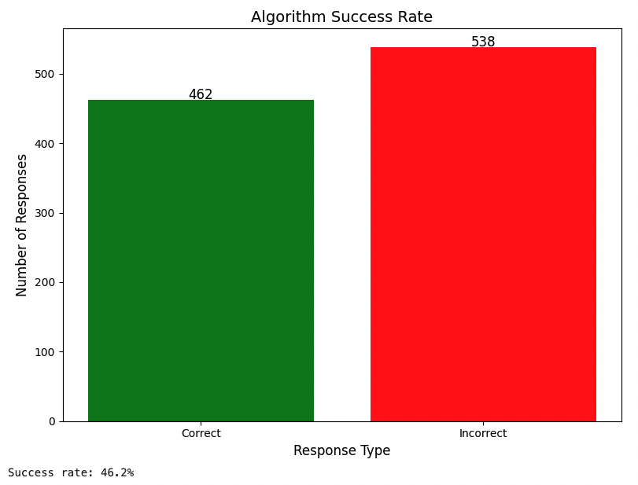
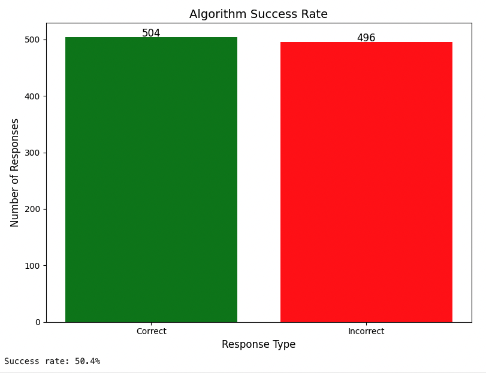
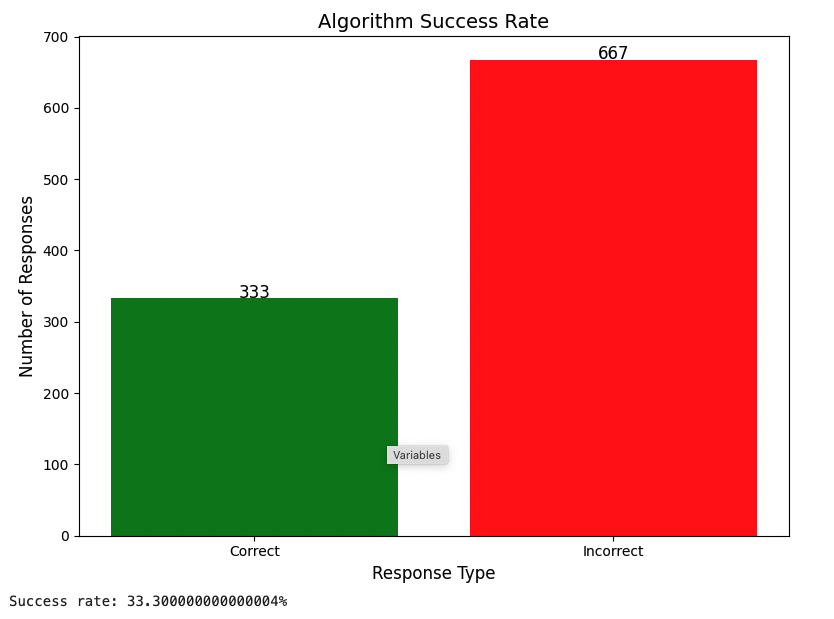
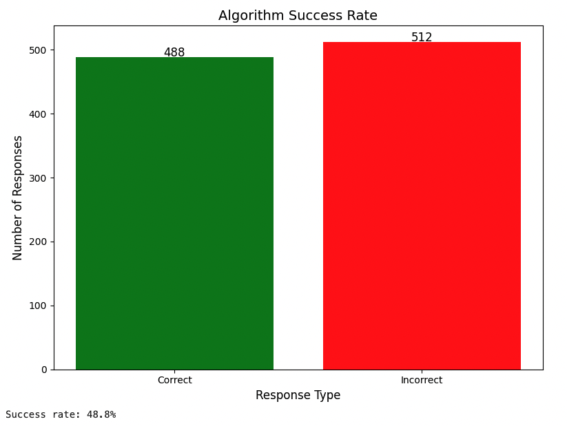
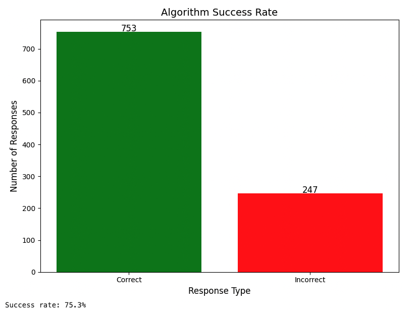

### Algorithm analysis

*g: generations*

*cr: crossover rate*

*mr: mutation rate*

It was tested 1000 times for each set of variables

- With `g:50` - `cr:0.25` - `mr:0.1`

Success rate: ~46%

- With `g:50` - `cr:0.25` - `mr:0.5`

Success rate: ~50%
> A medium mutation rate helped the results

- With `g:50` - `cr:0.25` - `mr:0.75`

Success rate: ~50%
> A high mutation rate worsened the results

- With `g:50` - `cr:0.5` - `mr:0.1`

Success rate: ~49%
> A medium and high crossover rate did little to help the results

- With `g:100` - `cr:0.25` - `mr:0.1`

Success rate: ~75%
> A medium generations helped the results a lot. The higher, the closer to 100%

